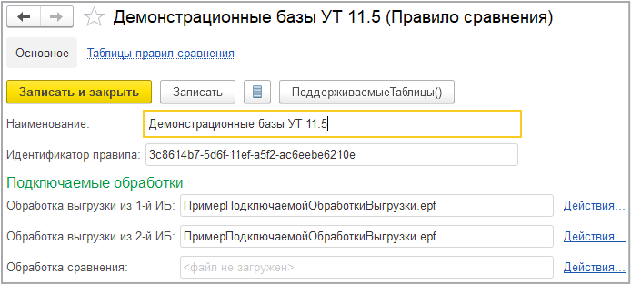
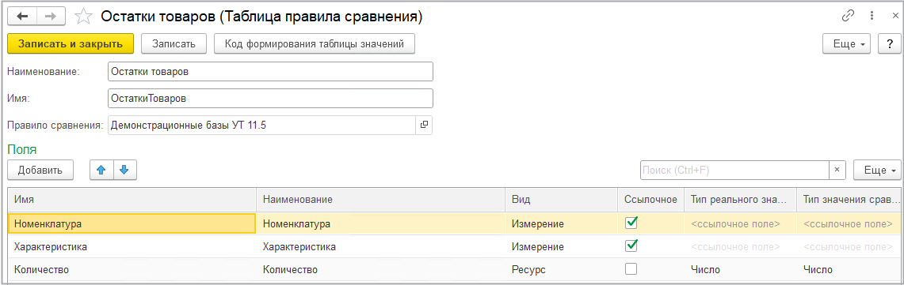

# Работа с правилами сравнения
---
## Справочник "Правила сравнения"
Справочник доступен в разделе "**Разработка**".

В карточке правила сравнения настраивается произвольное **наименование**.

Выводимый на форме **идентификатор правила** генерируется автоматически и не может быть изменен.

На форме также присутствует интерфейс для загрузки **подключаемых обработок** выгрузки и сравнения. Для загрузки обработки, выгрузки обработки в файл, а также удаления обработки из правила сравнения следует использовать гиперссылку "**Действия**" справа от имени файла обработки.

## Таблицы правил сравнения

Из карточки правила сравнения можно перейти к списку принадлежащих правилу **таблиц правила сравнения**.

На скриншоте ниже представлена форма таблицы правила сравнения.

**Наименование** предназначено только для отображения в формах в программе. **Имя** предназначено для идентификации таблицы, оно должно быть уникальным, а также должно соответствовать правилам именования переменных встроенного языка 1С.

У каждого поля настраивается:

- **Имя** - уникальное (в пределах таблицы) имя, используемое для идентификации. Должно соответствовать правилам именования переменных встроенного языка 1С;
- **Наименование** - используется только для вывода в программе;
- **Вид** - указывает, что поле является либо измерением, либо ресурсом;
- **Ссылочное** - включает режим ссылочного поля. Типы реального значения и значения сравнения становятся недоступными для редактирования;
- **Тип реального значения** - тип значения, фактически выгружаемого из сравниваемых информационных баз;
- **Тип значения сравнения** - тип значения, используемого для сравнения.