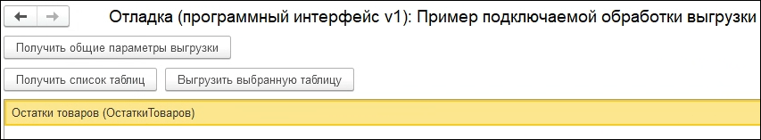

# Разработка подключаемых обработок выгрузки
---

## Создание подключаемой обработки выгрузки
Для создания собственной обработки выгрузки рекомендуется воспрользоваться шаблоном - внешней обработкой **ШаблонПодключаемойОбработкиВыгрузки.epf** из комплекта поставки Сравнителя. Создайте копию шаблона, откройте обработку в Конфигураторе и измените его имя.

В модуле объекта обработки будет содержаться шаблонный код для быстрого начала разработки, а основной формой обработки будет специальная форма отладки.

## Программный интерфейс обработки
### Функция ВерсияПрограммногоИнтерфейса
Программный интерфейс подключаемых обработок **версионируется**. Сравнитель версии 1.0.1 работает только с версией "1" программного интерфейса. Это число должна вернуть функция `ВерсияПрограммногоИнтерфейса()`:

```
// Определяет версию программного интерфейса, для которой была написана данная обработка
// 
// Возвращаемое значение:
//  Число - Всегда "1"
Функция ВерсияПрограммногоИнтерфейса() Экспорт
	Возврат 1;
КонецФункции
```

### Функция ПоддерживаемыеТаблицы
Данная функция перечисляет список таблиц, которые "умеет" выгружать данная подключаемая обработка. В этой функции должны быть перечислены все таблицы из правила сравнения, для которого разрабатывается обработка.

Пример реализации:

```
// Перечисляет таблицы, поддерживаемые к выгрузке данной обработкой
//
// Для каждой таблицы необходимо создать экспортную функцию по шаблону:
//
//// Выгружает таблицу "<ИмяТаблицы>"
////
//// Параметры:
////  ОбщиеПараметрыВыгрузки - Произвольный - Параметры, вычисленные ранее функцией ОбщиеПараметрыВыгрузки,
////                           либо полученные из выгрузки из 1-й ИБ
////
//// Возвращаемое значение:
////  ТаблицаЗначений - Данные для передачи в Сравнитель для сравнения
////
//Функция ВыгрузитьТаблицу<ИмяТаблицы>(ОбщиеПараметрыВыгрузки) Экспорт
//	// TODO: Вставить код для выгрузки таблицы
//КонецФункции
// 
// Возвращаемое значение:
//  СписокЗначений - Список поддерживаемых таблиц
//                   Значением элемента должно быть имя таблицы
//                   Представление элемента используется для вывода в Мастере выгрузки данных в Сравнитель.
//
Функция ПоддерживаемыеТаблицы() Экспорт
	Таблицы = Новый СписокЗначений;
	
	Таблицы.Добавить("ОстаткиТоваров", НСтр("ru='Остатки товаров'"));
	Таблицы.Добавить("Цены", НСтр("ru='Цены номенклатуры'"));
	Таблицы.Добавить("Контрагенты", НСтр("ru='Контрагенты'"));
	
	Возврат Таблицы;
КонецФункции
```

### Функция ОбщиеПараметрыВыгрузки
При выгрузке из 1-й ИБ единоразово вычисляет общие параметры выгрузки - произвольное значение, передаваемое в функции выгрузки таблиц.

При выгрузке из 2-й ИБ в функции выгрузки таблиц передается значение, ранее рассчитанное в 1-й ИБ.

Пример реализации:

```
// Вычисляет общие параметры выгрузки.
// Общие параметры выгрузки вычисляются один раз перед выгрузкой из 1-й ИБ, после чего
// передаются в функции выгрузки таблиц как в 1-й, так и во 2-й ИБ
// 
// Возвращаемое значение:
//  Произвольный - Значение общих параметров выгрузки. Должно быть сериализуемым
Функция ОбщиеПараметрыВыгрузки() Экспорт
	Возврат Новый Структура("ПериодОстатков", ТекущаяДатаСеанса());
КонецФункции
```

### Функции выгрузки содержимого таблиц
Для выгрузки данных по каждой таблице необходимо создать экспортные функции с именем вида `ВыгрузитьТаблицу<ИмяТаблицы>`, где `<ИмяТаблицы>` - имя, заданное в таблице правила сравнения в Сравнителе и в функции `ПоддерживаемыеТаблицы()`.

Функция принимает единственный параметр - общие параметры выгрузки, вычисляемые функцией `ОбщиеПараметрыВыгрузки`.

Пример реализации:

```
// Выгружает таблицу "ОстаткиТоваров"
//
// Параметры:
//  ОбщиеПараметрыВыгрузки - Произвольный - Параметры, вычисленные ранее функцией ОбщиеПараметрыВыгрузки,
//                           либо полученные из выгрузки из 1-й ИБ
//
// Возвращаемое значение:
//  ТаблицаЗначений - Данные для передачи в Сравнитель для сравнения
//
Функция ВыгрузитьТаблицуОстаткиТоваров(ОбщиеПараметрыВыгрузки) Экспорт
	Таблица = Новый ТаблицаЗначений;
	Таблица.Колонки.Добавить("Номенклатура", Новый ОписаниеТипов("Строка"));
	Таблица.Колонки.Добавить("Характеристика", Новый ОписаниеТипов("Строка"));
	Таблица.Колонки.Добавить("Количество", Новый ОписаниеТипов("Число",,, Новый КвалификаторыЧисла(15, 3)));
	
	Запрос = Новый Запрос;
	Запрос.Текст = 
		"ВЫБРАТЬ
		|	ТоварыНаСкладахОстатки.Номенклатура КАК Номенклатура,
		|	ТоварыНаСкладахОстатки.Характеристика КАК Характеристика,
		|	ТоварыНаСкладахОстатки.ВНаличииОстаток КАК ВНаличииОстаток
		|ИЗ
		|	РегистрНакопления.ТоварыНаСкладах.Остатки(&Период, ) КАК ТоварыНаСкладахОстатки
		|
		|УПОРЯДОЧИТЬ ПО
		|	Номенклатура,
		|	Характеристика";
	
	Запрос.УстановитьПараметр("Период", ОбщиеПараметрыВыгрузки.ПериодОстатков);
	
	РезультатЗапроса = Запрос.Выполнить();
	
	Выборка = РезультатЗапроса.Выбрать();
	
	Пока Выборка.Следующий() Цикл
		СтрТаблица = Таблица.Добавить();
		СтрТаблица.Номенклатура = СсылкаВСтроку(Выборка.Номенклатура);
		СтрТаблица.Характеристика = СсылкаВСтроку(Выборка.Характеристика);
		СтрТаблица.Количество = Выборка.ВНаличииОстаток;
	КонецЦикла;
	
	Возврат Таблица;
КонецФункции

Функция СсылкаВСтроку(Ссылка)
	Возврат СтрШаблон("%1 %2", Ссылка.УникальныйИдентификатор(), Ссылка);
КонецФункции
```

### Выгрузка значений ссылочных полей
Если поле в таблице правила сравнения имеет флажок "**Ссылочное**", его необходимо выгружать в виде строки следующего формата:

`65627b2d-b63d-4aba-8c2d-732af7ad34e2 Представление ссылки`

Первые 36 символов - уникальный идентификатор ссылки. После уникального идентификатора должен идти произвольный символ-разделитель. После этого символа должно быть представление ссылки.

Значение в примере выше будет расшифровано Сравнителем как значение со значением сравнения `65627b2d-b63d-4aba-8c2d-732af7ad34e2` и представлением `Представление ссылки`.

## Форма отладки обработки
Шаблон подключаемой обработки из комплекта поставки содержит не только заготовку программного интерфейса в модуле объекта, но и форму отладки:



Данная форма позволяет вызвать все предусмотренные спецификацией программного интерфейса функции. При вызове команд формы корректно срабатывают точки останова в Конфигураторе.