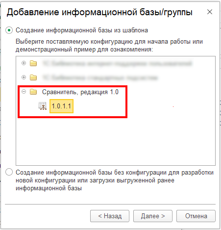
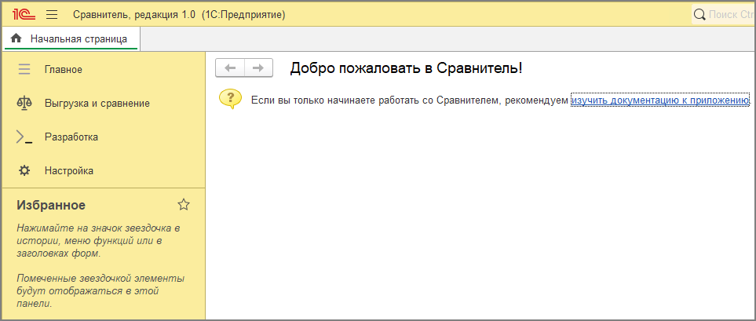

# Установка конфигурации
---
Сравнитель поставляется так же, как и типовые конфигурации фирмы "1С" - в виде ZIP-архива с установщиком.

Для установки конфигурации в каталог шаблонов необходимо:

1. Распаковать архив поставки;
2. Запустить установщик (**setup**) в распакованной папке и выполнить установку (предлагаемый каталог для установки изменять не рекомендуется).

Создание информационной базы Сравнителя не отличается от создания базы любой типовой конфигурации - необходимо создать новую информационную базу через программу запуска, выбрав в качестве шаблона установленную версию Сравнителя:

После создания базы откройте приложение в режиме 1С:Предприятие и дождитесь окончания начального заполнения. Если появилась главная страница - установка и начальное заполнение прошли успешно:

