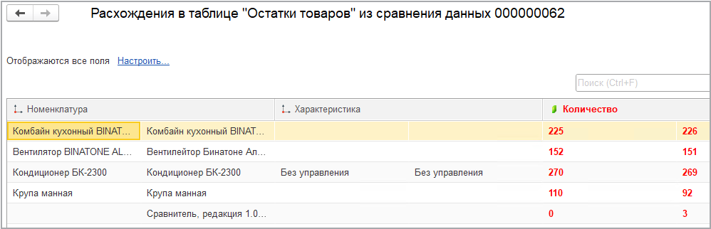
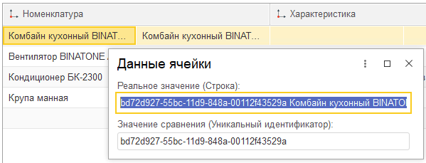

# Просмотр результатов сравнения
---
После выполнения сравнения данных документ "**Сравнение данных**" перейдет в статус "**Нет расхождений**", либо "**Есть расхождения**".

Для просмотра отчета о составе расхождений можно воспользоваться соответствующей гиперссылкой в форме документа:

По нажатию гиперссылки отобразится отчет следующего вида:

В отчете выводятся **представления** значений полей. Для просмотра значений сравнения и реальных значений необходимо дважды кликнуть на интересующее значение:

