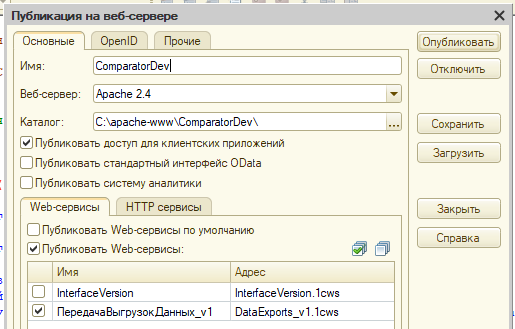

# Публикация веб-сервиса Сравнителя
---
Сравнитель имеет встроенный веб-сервис для передачи выгрузок данных целевыми ИБ. При использовании сценария с [передачей выгрузок по инициативе целевых ИБ](to-comparator.md) рекомендуется использовать веб-сервис вместо COM-соединения.

Для публикации веб-сервиса требуется:

- Веб-сервер Apache или Microsoft IIS;
- Права администратора на сервере.

Для работы веб-сервиса в настройках публикации достаточно включить веб-сервисы, имена которых начинаются на "*ПередачаВыгрузокДанных*".

Подробная информация о публикации информационных баз на веб-сервере см. в [руководстве администратора](https://its.1c.ru/section/dev/doc_dev) используемой версии технологической платформы.