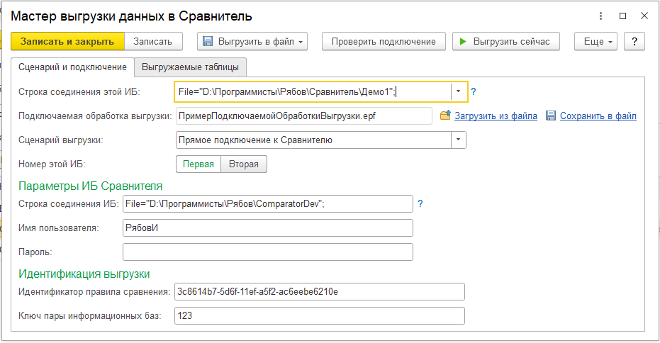
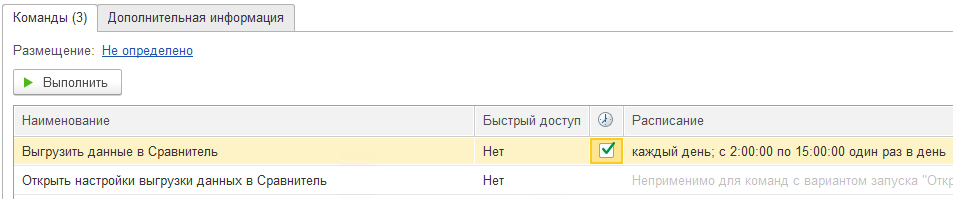

# Установка Мастера выгрузки
---
**Мастер выгрузки данных в Сравнитель** - это дополнительная обработка, предназначенная для выгрузки данных во всех сценариях, кроме "[Получение выгрузки от целевых баз по инициативе Сравнителя](from-comparator.md)".

Работоспособность обработки гарантируется в конфигурациях на базе Библиотеки стандартных подсистем версий 3.1.9 и 3.1.10. Для определения версии БСП перейдите в регистр сведений "Версии подсистем" в сравниваемой ИБ - текущая версия БСП будет указана в записи подсистемы "*СтандартныеПодсистемы*".

Мастер выгрузки входит в комплект поставки Сравнителя.

Мастер выгрузки устанавливается **внутри сравниваемой информационной базы**, не в Сравнителе. Установка производится через стандартную подсистему "**Дополнительные отчеты и обработки**".

Установленный Мастер выгрузки имеет несколько команд:

- **Открыть настройки выгрузки данных в Сравнитель** - открывает форму настроек, описанную ниже;
- **Выгрузить данные в Сравнитель** - выполняет выгрузку данных. На эту команду можно настроить расписание в карточке дополнительной обработки.

Команды, имеющие пометку "*служебная команда*", предназначены для внутреннего использования обработкой, их ручной запуск не допускается.

## Настройки выгрузки
Используя команду "**Открыть настройки выгрузки данных в Сравнитель**", можно попасть в форму настроек обработки:

Для получения справки по использованию данной формы настроек используйте встроенную в обработку справочную информацию (клавиша **F1**).

## Выгрузка данных по расписанию
Непосредственной выгрузкой данных по заданным настройкам занимается команда "**Выгрузить данные в Сравнитель**". Для настройки выгрузки по расписанию необходимо установить расписание этой команде. На скриншоте ниже приведен пример такой настройки.

> *Примечание*. Выгрузка указанной командой не будет работать, если фактическая строка соединения информационной базы (путь к каталогу файловой базы или имя кластера и базы на сервере) не совпадает с указанной в настройках, а также если в базе запрещена работа с внешними ресурсами (т.е. база считает себя *копией*).